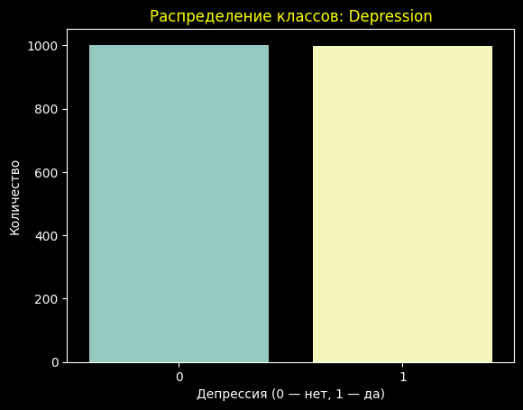
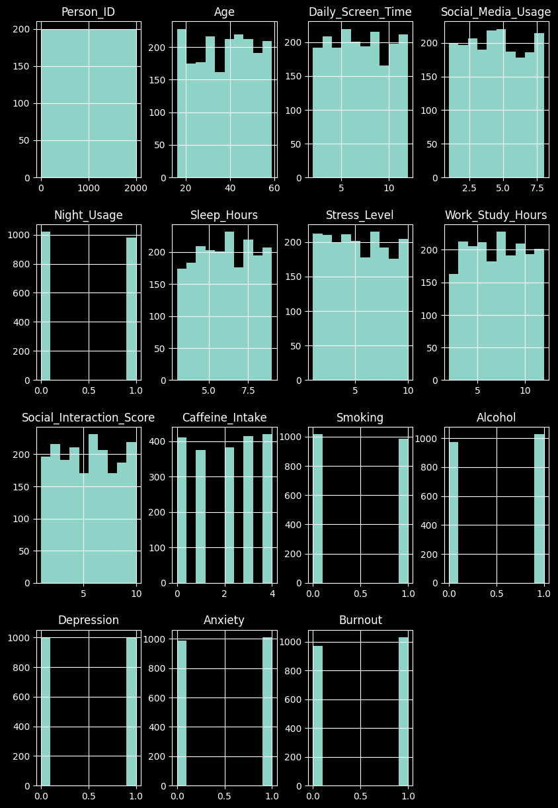
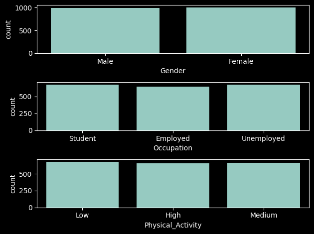
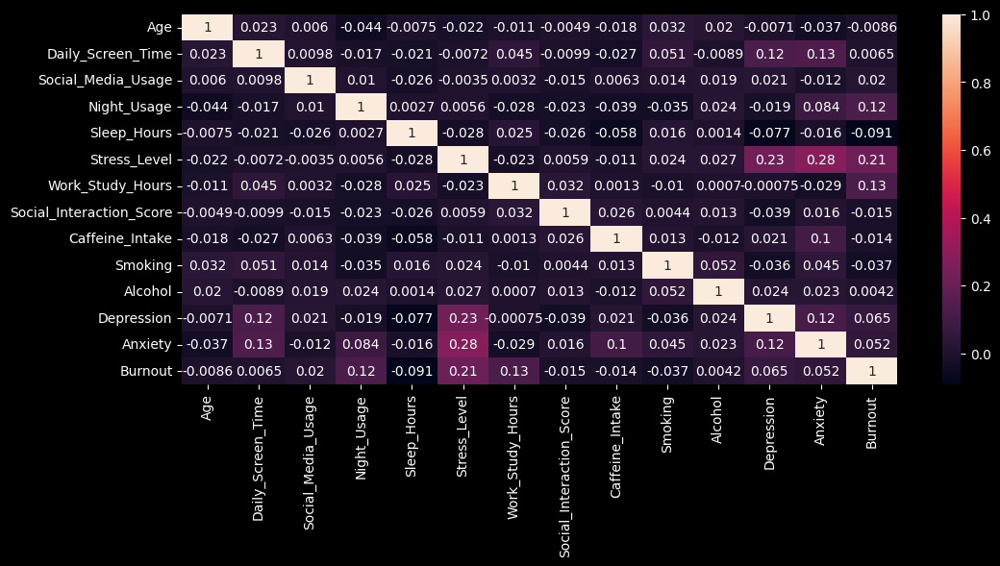
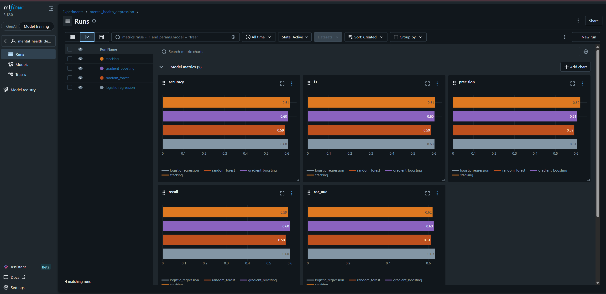
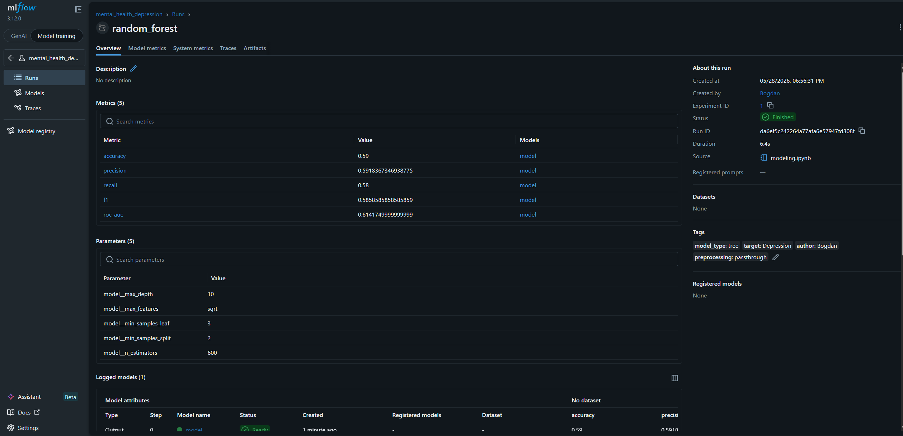
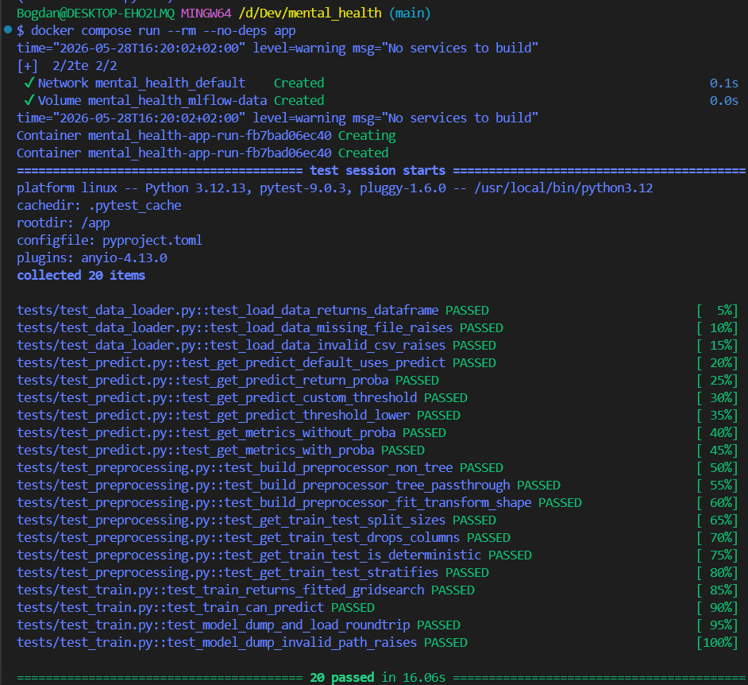

# Mental Health Depression Prediction

> ML-пайплайн для бинарной классификации депрессии по поведенческим признакам
> (экранное время, сон, стресс, привычки и т.д.).

---

## Стек

- **Python 3.12**, управление зависимостями — **Poetry**
- **scikit-learn** — модели и препроцессинг
- **MLflow 3.12** — трекинг экспериментов
- **pytest** — тесты (20 шт.)
- **Docker + docker-compose** — воспроизводимое окружение и изолированный MLflow
- **GitHub Actions** — CI

---

## Структура репозитория

```
mental_health/
├── data/
│   └── mental_health.csv          # исходный датасет (2000 × 18)
├── notebooks/
│   ├── EDA.ipynb                   # разведочный анализ данных
│   └── modeling.ipynb              # обучение 4 моделей + логирование в MLflow
├── src/
│   ├── data_loader.py              # load_data() — чтение CSV
│   ├── preprocessing.py            # build_preprocessor(), get_train_test()
│   ├── train.py                    # train() (GridSearchCV), model_dump/model_load
│   ├── predict.py                  # get_predict(), get_metrics()
│   └── tracking.py                 # setup_mlflow(), log_experiment()
├── tests/
│   ├── conftest.py                 # фикстуры на реальных данных
│   ├── test_data_loader.py
│   ├── test_preprocessing.py
│   ├── test_train.py
│   └── test_predict.py
├── models/                         # сохранённые .pkl
├── screens/                        # скриншоты UI MLflow и pytest
├── Dockerfile
├── docker-compose.yml
├── .github/workflows/ci.yml        # CI/CD пайплайн
├── pyproject.toml
└── poetry.lock
```

---

## Данные

- **2000 наблюдений, 18 признаков.**
- **Целевая переменная:** `Depression` (бинарная, классы сбалансированы ~50/50).
- **Числовые признаки:** `Age`, `Daily_Screen_Time`, `Social_Media_Usage`,
  `Night_Usage`, `Sleep_Hours`, `Stress_Level`, `Work_Study_Hours`,
  `Social_Interaction_Score`, `Caffeine_Intake`, `Smoking`, `Alcohol`.
- **Категориальные признаки:** `Gender`, `Occupation`, `Physical_Activity`.
- Дроп при тренировке: `Person_ID`, `Anxiety`, `Burnout` (другие таргеты).

---

## Разведочный анализ (`notebooks/EDA.ipynb`)

Этапы анализа:

1. Загрузка и обзор типов признаков
2. Описательная статистика (`df.describe()`)
3. Распределение целевой переменной
4. Гистограммы всех числовых признаков
5. Распределения категориальных признаков
6. Корреляционная матрица числовых признаков
7. Группировки и связи с депрессией (pivot-таблицы)

### Распределение целевой переменной

Классы сбалансированы — по ~1000 наблюдений в каждом.

<p align="center">
  
</p>

### Распределения числовых признаков

<p align="center">
  
</p>

### Распределения категориальных признаков

<p align="center">
  
</p>

### Корреляционная матрица

<p align="center">
  
</p>

### Ключевые выводы

- **`Stress_Level`** имеет наибольшую корреляцию с депрессией (≈ **0.225**).
- У людей с депрессией экранное время в среднем выше на **~0.8 часа**.
- Монотонная связь: при низком экранном времени депрессия — **41.7 %**,
  при высоком — **56.4 %**.
- У женщин связь между экранным временем и депрессией выражена сильнее.

---

## Моделирование (`notebooks/modeling.ipynb`)

**Подход:** `GridSearchCV` со стратифицированной 5-фолд CV, `scoring="roc_auc"`.

**Препроцессинг** строится `src.preprocessing.build_preprocessor()`:

| Тип модели    | Числовые признаки                      | Категориальные                       |
|---------------|----------------------------------------|--------------------------------------|
| Линейные      | `StandardScaler` + `PolynomialFeatures`| `OneHotEncoder(drop="first")`        |
| Деревья       | `passthrough` (как есть)               | `OneHotEncoder(drop="first")`        |

### Результаты на тестовой выборке

| Модель              | Accuracy | Precision | Recall | F1    | ROC-AUC |
|---------------------|---------:|----------:|-------:|------:|--------:|
| Logistic Regression |   0.605  |   0.606   |  0.600 | 0.603 | **0.633** |
| Random Forest       |   0.590  |   0.592   |  0.580 | 0.586 |   0.614 |
| Gradient Boosting   |   0.605  |   0.606   |  0.600 | 0.603 |   0.627 |
| **Stacking**        | **0.615**| **0.621** |  0.590 |**0.605**| 0.621 |

- Лучшая по `accuracy`/`f1` — **Stacking** (LR + RF + GB → LR-мета).
- Лучшая по `ROC-AUC` — **Logistic Regression**.

Сохранённые модели лежат в `models/*.pkl`
(`logistic_regression.pkl`, `random_forest.pkl`,
`gradient_boosting.pkl`, `stacking.pkl`).

---

## MLflow

Все запуски логируются в эксперимент `mental_health_depression` через
`src.tracking.setup_mlflow()` и `src.tracking.log_experiment()`.
Каждый run пишет:

- параметры лучшей модели (`gs.best_params_`)
- метрики (`accuracy`, `precision`, `recall`, `f1`, `roc_auc`)
- теги (`model_type`, `target`, `preprocessing`, `author`)
- сам артефакт модели (`mlflow.sklearn.log_model`)

### Запуск tracking-сервера в Docker

```bash
docker compose up -d mlflow
# UI → http://localhost:5000
```

### Сравнение метрик 4 моделей в MLflow UI



### Деталка Random Forest run



---

## Тесты

20 тестов на `pytest` покрывают `data_loader`, `preprocessing`, `train`, `predict`.
Фикстуры (`tests/conftest.py`) построены на **реальном** датасете
`data/mental_health.csv` — стратифицированная выборка, реальные имена признаков.

```bash
# локально
poetry run pytest tests/ -v

# внутри Docker-образа
docker compose run --rm --no-deps app
```



---

## Docker

`Dockerfile` базируется на `python:3.12-slim`, ставит зависимости из
`poetry.lock` (фиксация версий), создаёт non-root пользователя `appuser`,
дефолтная команда — `pytest tests/ -v` (smoke-проверка образа).

`docker-compose.yml` поднимает два сервиса:

- **`mlflow`** — tracking server на `:5000`, том `mlflow-data` для sqlite и артефактов.
- **`app`** — тот же образ; `MLFLOW_TRACKING_URI=http://mlflow:5000`,
  `./data:ro` смонтирован как read-only, `./models` — для записи артефактов.

```bash
docker compose build              # собрать образ
docker compose up -d mlflow       # MLflow UI на http://localhost:5000
docker compose run --rm app       # прогон тестов внутри образа
```

**Функции контейнеризации в пайплайне:**
- воспроизводимая среда (Python + версии из `poetry.lock` зафиксированы)
- изоляция MLflow tracking как отдельный сервис
- non-root пользователь и `:ro`-том на данные — базовая безопасность
- слой с зависимостями кешируется отдельно от слоя с кодом — быстрая пересборка

---

## CI/CD

`.github/workflows/ci.yml` запускается на push/PR в `main`:

1. **Job `tests`** — Python 3.12 + Poetry, кеш зависимостей по хешу
   `poetry.lock`, прогон `pytest tests/ -v`.
2. **Job `docker`** (зависит от `tests`) — сборка образа из `Dockerfile`
   через `buildx` с GHA-кешем + smoke-тест: `docker run ... pytest tests/ -v`
   внутри готового образа.

Минимальные git-команды для отправки изменений:

```bash
git checkout -b feature/<name>
git add .
git commit -m "..."
git push -u origin feature/<name>
# открыть PR на GitHub → дождаться зелёных галочек → merge в main
```

---

## Быстрый старт

```bash
# 1. Клонировать и установить зависимости
git clone <repo-url>
cd mental_health
poetry install

# 2. Запустить тесты
poetry run pytest tests/

# 3. Поднять MLflow tracking server (Docker)
docker compose up -d mlflow
# UI: http://localhost:5000

# 4. Открыть ноутбук с обучением
poetry run jupyter lab notebooks/modeling.ipynb
```
